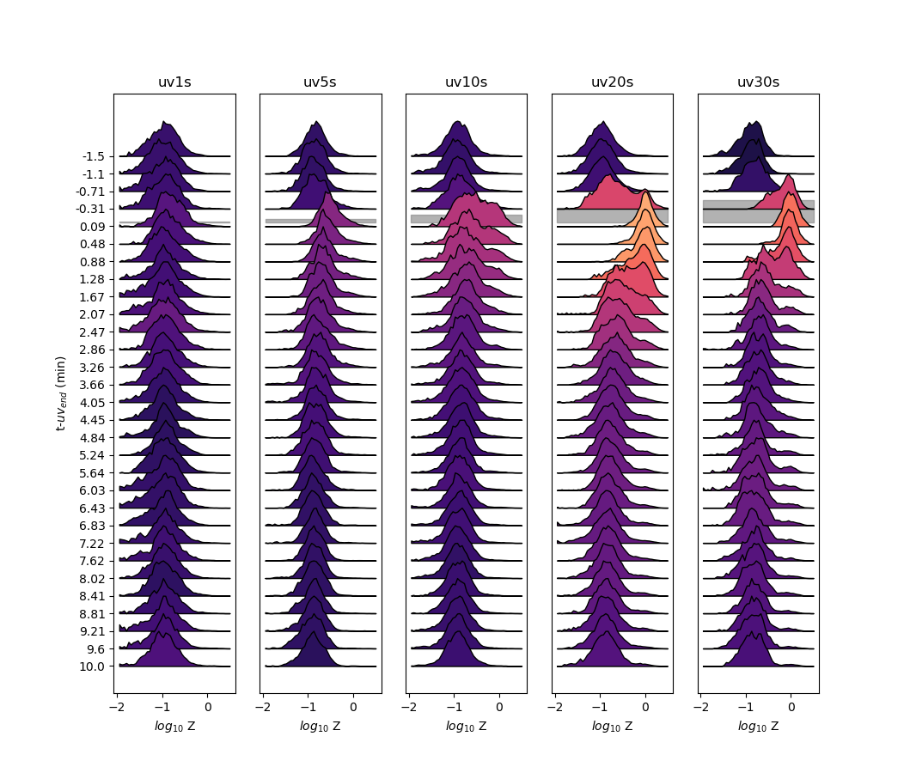

# histogramOverlay

Function for plotting dynamics of density functions

### Package dependencies

```
python 3
numpy
matplotlib

```
## Arguments
* X = data, (samples,timepoints)  
* t = time points of sample, matches X.shape[1]
* t_sample = timepoints to draw histogram at
* window = window around t_sample to make distribution from
* ybins = bins to make distribution with
* overlay = overlap between histograms, (0,1)
* ax = matplotlib axis to draw graphs on
* normMax = bool, whether to normalize distribution by max value for aesthetic purposes

## Demo


## Authors

* **Samuel Bray**


## License

This project is licensed under GNUV3
